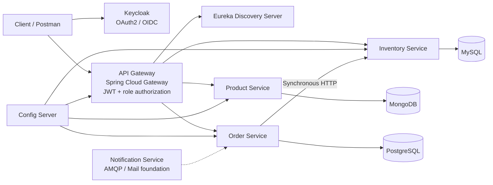
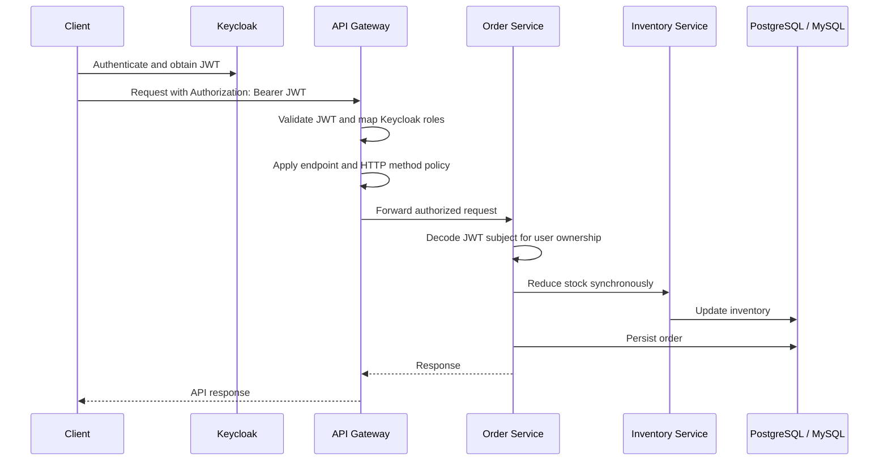
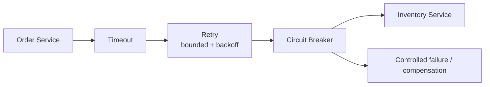
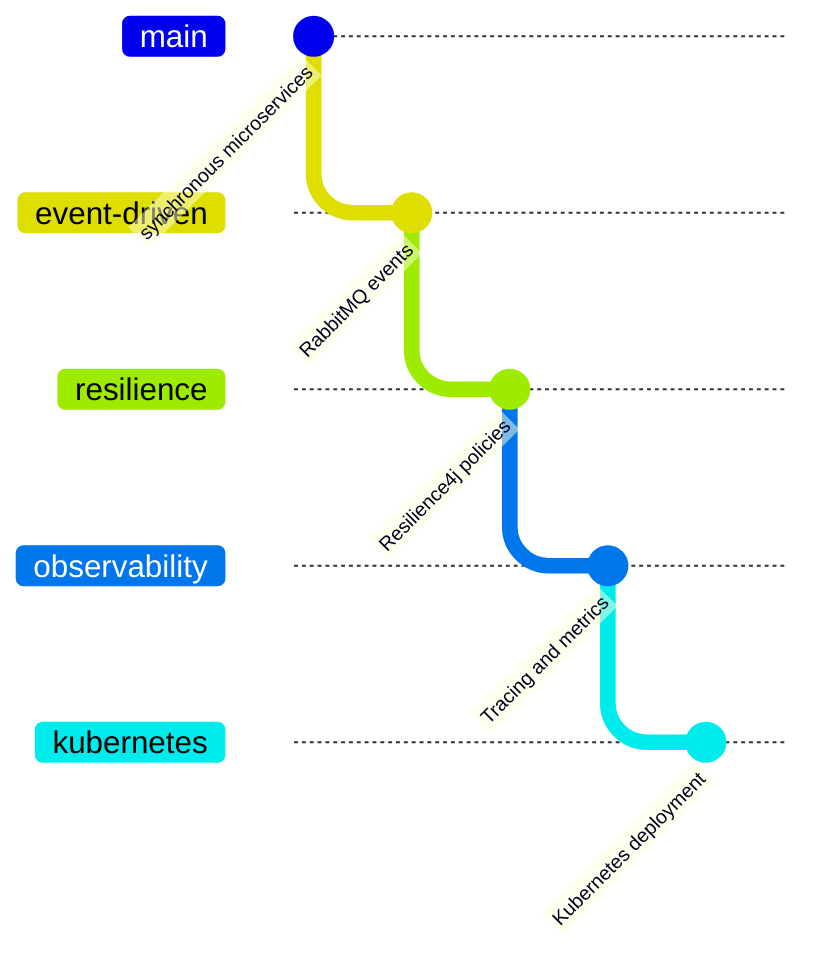

# Practices E-Commerce Platform

A modular e-commerce platform built with Java and Spring Boot. The repository is designed as a learning and evolution-oriented project: it currently demonstrates synchronous microservices, service discovery, centralized configuration, API gateway security, and polyglot persistence, while leaving a clear path toward event-driven architecture, resilience, observability, and Kubernetes-native deployments.

## Repository description

> Modular e-commerce platform built with Spring Boot microservices, API Gateway security, Keycloak, service discovery, centralized configuration, polyglot persistence, and an evolution roadmap toward event-driven workflows, Saga orchestration, resilience, observability, and Kubernetes-native deployments.

## Current architecture



### Services

| Component | Responsibility | Main technology |
| --- | --- | --- |
| API Gateway | External entry point, routing, JWT validation, role-based authorization | Spring Cloud Gateway, Spring Security, OAuth2 Resource Server |
| Discovery Server | Service registration and discovery | Spring Cloud Netflix Eureka Server |
| Config Server | Centralized externalized configuration | Spring Cloud Config Server backed by Git |
| Product Service | Product catalog management | Spring Boot, Spring MVC, Spring Data MongoDB |
| Inventory Service | Inventory and stock operations | Spring Boot, Spring MVC, Spring Data JPA, MySQL |
| Order Service | Order creation and queries; stock coordination | Spring Boot, Spring MVC, Spring Data JPA, PostgreSQL |
| Notification Service | Notification foundation for future asynchronous workflows | Spring Boot, Spring AMQP, Spring Mail |
| Keycloak | Identity provider and role claims | OAuth2, OpenID Connect |

## Technology stack

- Java 25
- Spring Boot 4.1.0
- Spring Cloud 2025.1.2
- Spring Cloud Gateway Server WebFlux
- Spring Cloud Config
- Spring Cloud Netflix Eureka
- Spring Security OAuth2 Resource Server
- Keycloak for identity and access management
- Spring Web MVC and WebFlux
- Spring Data JPA / Hibernate
- PostgreSQL for orders
- MySQL for inventory
- MongoDB for products
- Spring AMQP and Spring Mail in the notification service foundation
- Maven Wrapper for reproducible builds
- Docker Compose for local infrastructure
- Lombok and MapStruct for reducing boilerplate and mapping DTOs
- Actuator for health and operational endpoints

## Request and authorization flow



The Gateway is the public authorization boundary. It maps Keycloak roles into Spring authorities and applies policies such as:

- `USER`: create orders and retrieve the authenticated user's orders.
- `ADMIN`: list all orders and retrieve an order by ID.
- Public read access is currently available for product and inventory reads according to the Gateway configuration.

The Order Service still decodes the JWT because it needs the token subject to associate orders with a user. It does not duplicate the Gateway's role policy.

## Clean Architecture

The domain services are organized around Clean Architecture principles:

```text
service/
├── presentation/       HTTP controllers and API boundaries
├── application/
│   ├── dto/             Request and response contracts
│   ├── mapper/          DTO/domain mapping
│   ├── service/         Use-case interfaces and implementations
│   └── validator/       Application validation rules
├── domain/
│   ├── model/           Business entities
│   └── repository/      Repository ports
├── infrastructure/
│   ├── client/          External service clients
│   ├── config/          Framework and integration configuration
│   └── persistence/     JPA/Mongo persistence adapters and entities
└── shared/              Exceptions, advice, and cross-cutting utilities
```

The application layer coordinates use cases, the domain layer contains business concepts and ports, and infrastructure provides adapters for databases and remote services. Controllers depend on application interfaces rather than persistence implementations.

## Engineering practices

- Keep business rules inside use cases and domain-oriented components.
- Depend on interfaces at application boundaries; keep database and HTTP details in infrastructure.
- Validate request DTOs at the API boundary with Jakarta Validation.
- Use consistent error responses and meaningful HTTP status codes.
- Keep configuration externalized through Config Server and environment variables.
- Never commit credentials, tokens, passwords, or local `.env` files.
- Use explicit HTTP method and endpoint authorization rules at the Gateway.
- Prefer idempotent operations where retries may be introduced.
- Add correlation IDs and structured logs before expanding distributed workflows.
- Test failure paths, not only successful requests.

## Resilience roadmap

The current Order → Inventory interaction is synchronous. The following patterns are planned and should be introduced at the outbound client boundary, especially in `Order Service`:



### Timeout

Set connection and response timeouts for calls to Inventory. A request must fail within a known budget instead of consuming threads indefinitely.

### Retry

Retry only transient failures, using a small bounded number of attempts and exponential backoff with jitter. Do not retry validation errors, insufficient stock, authentication failures, or non-idempotent operations without an idempotency strategy.

### Circuit Breaker

Open the circuit when Inventory repeatedly fails, reject calls quickly while it is open, and use a half-open state to probe recovery. The fallback should return a meaningful service-unavailable response or trigger a compensating workflow; it must not silently create an order without stock confirmation.

### Recommended implementation path

1. Add Spring Cloud Circuit Breaker with Resilience4j.
2. Define timeout, retry, and circuit-breaker policies per remote dependency.
3. Add metrics for attempts, rejected calls, open circuits, and latency.
4. Introduce idempotency keys before retrying order creation.
5. Add integration tests for timeout, partial failure, duplicate delivery, and recovery.

These patterns are roadmap items unless their implementation is added to the corresponding branch.

## Future evolution

The repository is intended to evolve through separate branches:



Planned directions include:

1. Event-driven communication with RabbitMQ.
2. Data resilience, idempotency, optimistic locking, and high-throughput persistence strategies.
3. Observability with centralized logs, metrics, distributed tracing, dashboards, and alerting.
4. Kubernetes deployment with Helm, health probes, autoscaling, secrets, configuration, and progressive delivery.

## Local development

### Prerequisites

- Java 25
- Docker and Docker Compose
- Maven Wrapper support
- A running Keycloak realm named `ecommerce-realm`
- A Config Server and Eureka Server when running the complete distributed setup

### Environment

Copy the example file for the service or infrastructure component you are running and provide local values:

```bash
cp api-gateway/.env.example api-gateway/.env
```

Only `.env.example` files belong in version control. All real `.env` files are ignored by the repository-level `.gitignore`.

### Infrastructure

The root `docker-compose.yml` provisions local databases and Keycloak:

```bash
docker compose up -d
```

Then start the applications in this order:

1. Discovery Server
2. Config Server
3. Product, Inventory, Order, and Notification services
4. API Gateway

Each service can be built with its Maven Wrapper:

```bash
./mvnw clean verify
```

Run the command from the service directory that you want to build.

## Configuration and secrets

Configuration is externalized under `config-data/` and loaded through Spring Cloud Config. Local secrets should be supplied through environment variables. Do not commit:

- `.env` files
- Keycloak client secrets
- Database passwords
- GitHub tokens used by Config Server
- JWTs or exported identity-provider data containing secrets

## Branch strategy

The initial branch contains the synchronous microservice baseline. Future branches should isolate architectural changes so each evolution can be reviewed and tested independently:

- `event-driven-rabbitmq`
- `saga-orchestration`
- `resilience-patterns`
- `observability`
- `kubernetes-platform`

## License

Add the project license before publishing the repository publicly.
